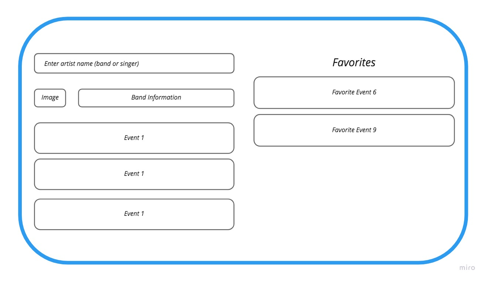

# Small web app to display Artists/Bands info & events”

## Requirenments

#### **Home page:**

- Allow the user to search for an artist (Using ​this​ [API](https://app.swaggerhub.com/apis/Bandsintown/PublicAPI/3.0.0). for app_id just use any random number)
- Upon a good search result:
  - Display artist meta-data: name, image
  - Display a list of events that are related to the artist
  - Display the user’s “favorite” events

#### **Upon selecting an event:**

- Navigate to a new page showing:
  - Event meta data
  - Event venue information
  - Special offers related to event
- Add to favorites button
- Display the venue using a map service of your choice

#### **Upon selecting - add to favorites:**

- Add this event to the favorites list
- Persist the favorites section, so that when the user refreshes he will see it again

#### **Styling & UI**

- Styling with Material-ui
- The app is responsive !

## -

### Here is a simple mock:

#

#### Home page

#### Events page

## Implementation highlights

1. Code

- React/Redux-toolkit
- Manage async API calls with redux-toolkit 'createAsyncThunk'
- Use Data normalization pattern of { ids: [], entities: {}} with redux-toolkit 'createEntityAdapter'
- Material-ui components composition
  - Read about caveats with inline function as an argument for the component prop [here](https://material-ui.com/guides/composition/#caveat-with-inlining)
  - Example: I used react-router-dom 'Navlink' componet as replacing component property with 'Button' , 'ListItem', 'CardActionArea'

2. Responsive- UI

- Menu buttons change shape when screen get smaller
- Menu buttons turn to just icons in mobile
- Search field size and position adjust to the change of screen size

3. UI-UX

- Show badge number of total exiting favorite items
- Home button for future use

 

This project was bootstrapped with [Create React App](https://github.com/facebook/create-react-app).

## Available Scripts

In the project directory, you can run:

### `npm start`

Runs the app in the development mode.\
Open [http://localhost:3000](http://localhost:3000) to view it in the browser.

The page will reload if you make edits.\
You will also see any lint errors in the console.

### `npm test`

Launches the test runner in the interactive watch mode.\
See the section about [running tests](https://facebook.github.io/create-react-app/docs/running-tests) for more information.

## Learn More

You can learn more in the [Create React App documentation](https://facebook.github.io/create-react-app/docs/getting-started).

To learn React, check out the [React documentation](https://reactjs.org/).
